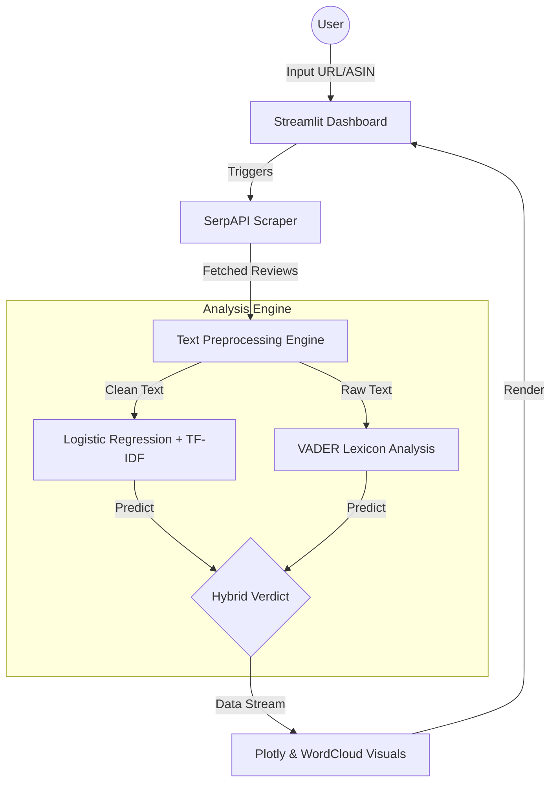
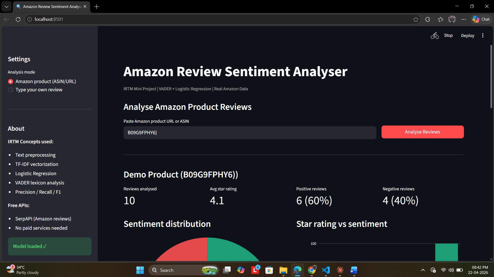
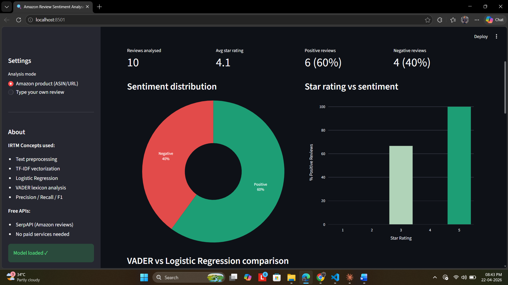
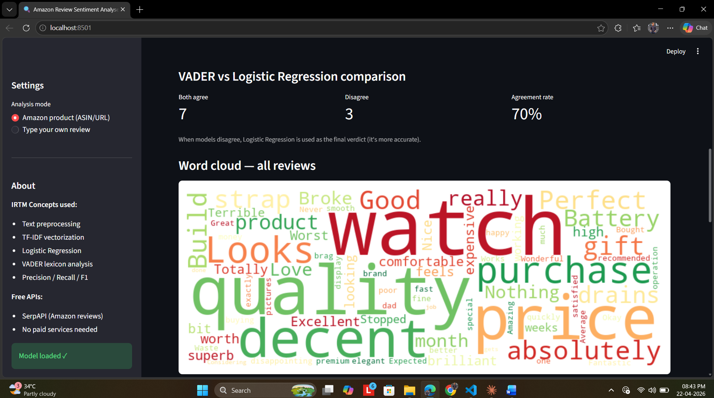
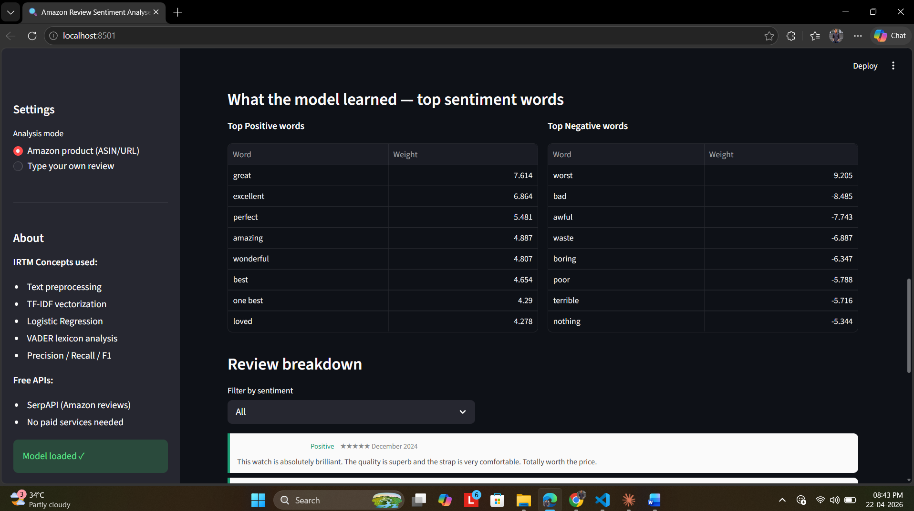
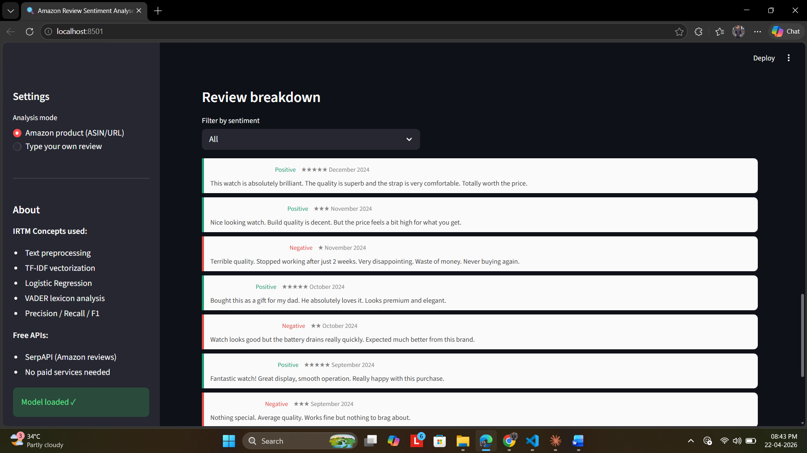

# 🚀 Amazon Review Sentiment Analyser

[](https://www.python.org/)
[](https://streamlit.io/)
[](https://en.wikipedia.org/wiki/Natural_language_processing)
[](https://scikit-learn.org/)

An advanced **End-to-End Sentiment Analysis Dashboard** that fetches real-time Amazon product reviews and performs deep sentiment classification using hybrid NLP techniques. Developed as an IRTM (Information Retrieval & Text Mining) project.

---

## 🌟 Overview

This project provides a comprehensive tool for understanding customer sentiment on Amazon products. By simply pasting a product URL or ASIN, the system scrapes live reviews and applies a **Hybrid Sentiment Analysis** approach. 

The system compares a rule-based engine (**VADER**) with a trained machine learning model (**Logistic Regression**) to provide the most accurate sentiment verdict. It visualizes data through interactive charts, word clouds, and detailed review breakdowns.

---

## 📐 Project Architecture



---

## 🧠 How It Works

### 1. Data Retrieval
- **Amazon Scraper:** Uses `SerpAPI` to bypass bot detection and fetch authentic, real-time reviews including star ratings, dates, and full text.
- **Custom Input:** Users can also type their own sentences to test the model's response live.

### 2. Hybrid Sentiment Engine
The core intelligence combines two distinct philosophies:
- **Lexicon-Based (VADER):** A rule-based sentiment tool specifically tuned for social media and product review language. It works instantly without training.
- **Machine Learning (Logistic Regression):** A model trained on the **IMDB 50K Movie Reviews** dataset. It uses **TF-IDF with Bigrams** to understand the context and weight of words.
- **Verdict Logic:** If the models disagree, the Logistic Regression model is used as the final verdict as it has been validated with high accuracy (~90%) on large datasets.

### 3. NLP Pipeline
- **Cleaning:** Strips HTML tags and non-alphabetic characters.
- **Stopword Removal:** Intelligent removal that preserves negations (e.g., "not", "never") to maintain sentiment context.
- **Lemmatization:** Normalizes words to their base form (e.g., "watched" → "watch").

---

## ✨ Key Features

- **🔍 Live Scraping:** No manual CSV uploads needed; just paste a link.
- **📊 Interactive Analytics:** 
  - **Sentiment Pie:** Real-time distribution of Positive/Negative feelings.
  - **Star Correlation:** See if 3-star reviews are actually positive or negative.
  - **Word Clouds:** Visual representation of most frequent descriptors.
- **⚖️ Model Validation:** Shows the agreement rate between different AI approaches.
- **📂 Review Explorer:** Filter and read through specific sentiments.

---

## 🛠️ Technical Stack

- **Frontend:** Streamlit (Python)
- **Data Handling:** Pandas, NumPy
- **Visuals:** Plotly Express, Matplotlib, WordCloud
- **NLP:** NLTK, VADER Sentiment
- **ML:** Scikit-Learn (Logistic Regression, TF-IDF Vectorization)
- **Data Source:** SerpAPI (Amazon Search Engine Results API)

---

## 🚀 Getting Started

### 1️⃣ Installation
```bash
pip install -r requirements.txt
```

### 2️⃣ Training the ML Brain
The project requires `model.pkl` and `vectorizer.pkl`. If they aren't present, run:
```bash
python sentiment_engine.py
```
*Note: Requires `IMDB Dataset.csv` in the same directory.*

### 3️⃣ Launching the Dashboard
```bash
streamlit run app.py
```

---

## 📚 IRTM Concepts Applied

| Concept | Description |
| :--- | :--- |
| **TF-IDF Vectorization** | Weighting words based on their importance across the dataset. |
| **Bigrams (N-grams)** | Analysing pairs of words (e.g., "not good") to capture context. |
| **Precision & Recall** | Used to evaluate the model's performance during training. |
| **Information Extraction** | Parsing ASINs from complex Amazon URLs automatically. |

---

## 🖼️ Dashboard Preview



### 📊 Sentiment Distribution & Trends

*Analysis of star ratings and sentiment distribution charts.*

---

### 🧩 Hybrid Model Comparison

*Agreement rate comparison between VADER and Logistic Regression.*

---

### 📉 Top Sentiment Features

*Keywords identified by the model as strongly positive or negative.*

---

### 📄 Detailed Review Breakdown

*Individual review analysis with final sentiment verdicts.*


---

## 👨‍💻 Created By

**Mohd Azad Chaudhary**  
*IRTM Mini Project*

---
